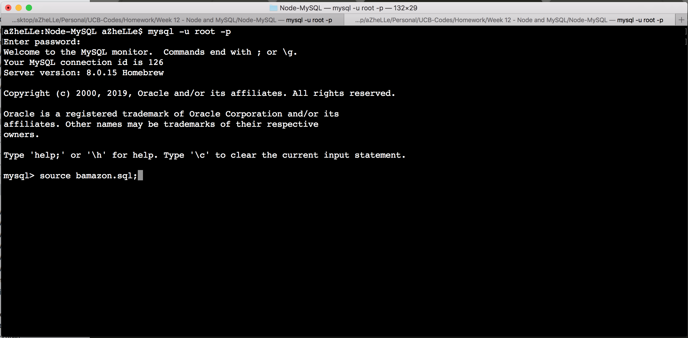
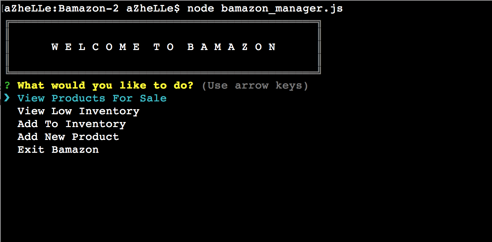
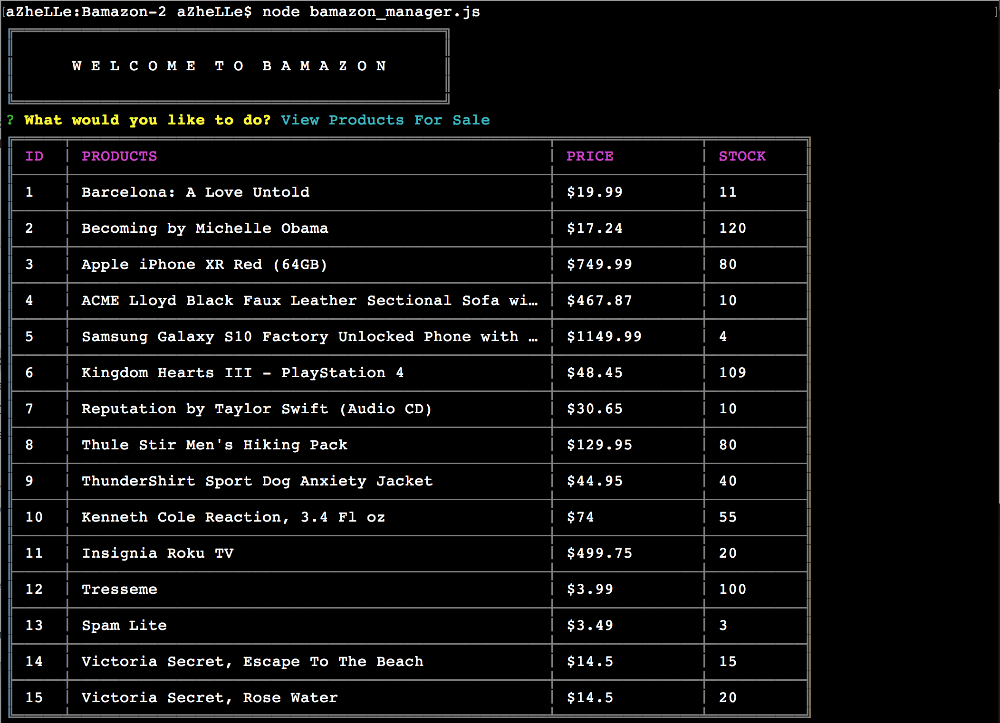
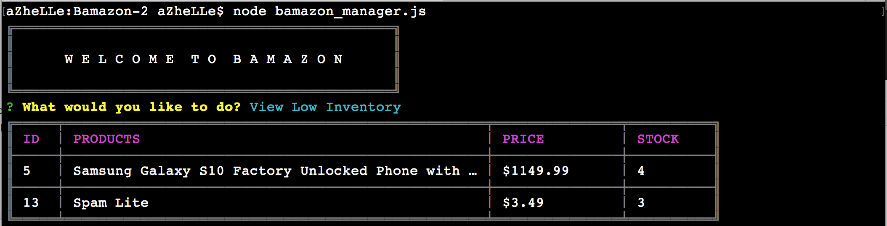
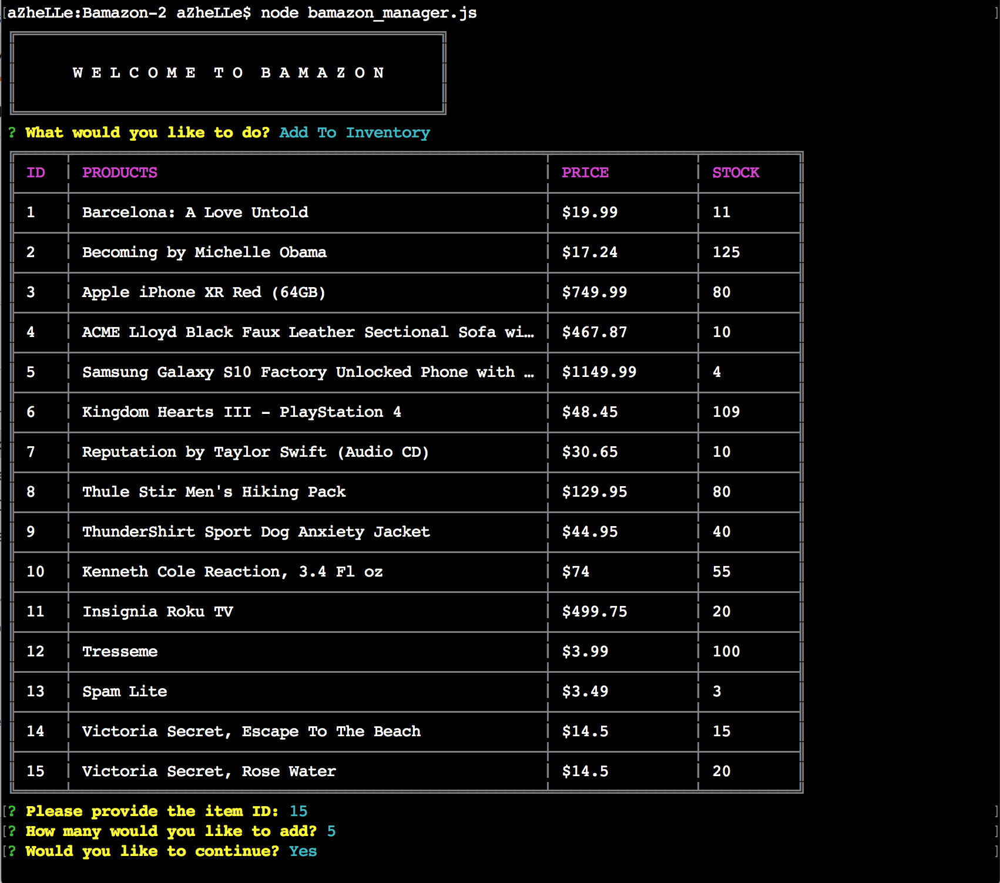
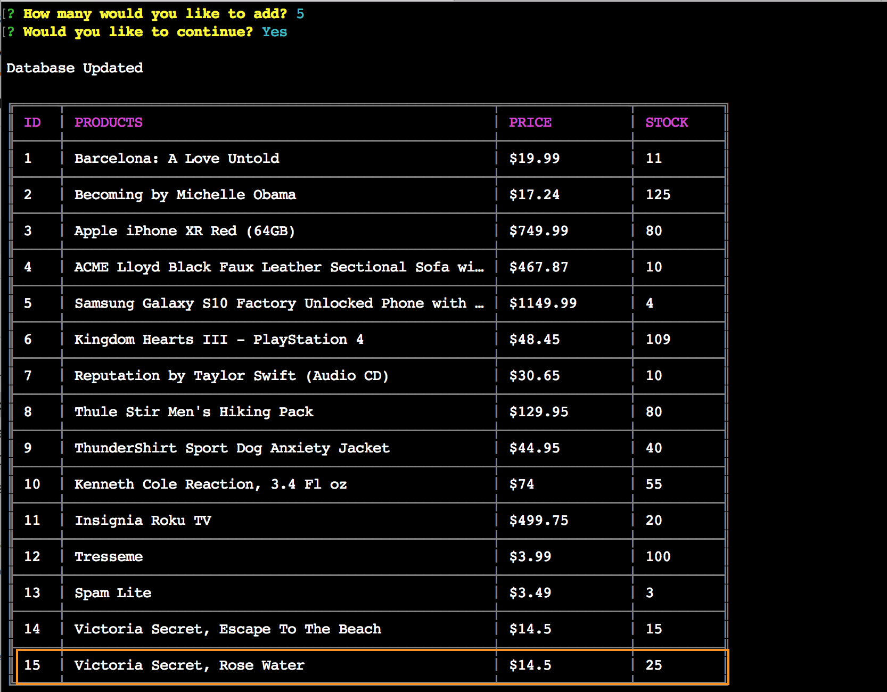
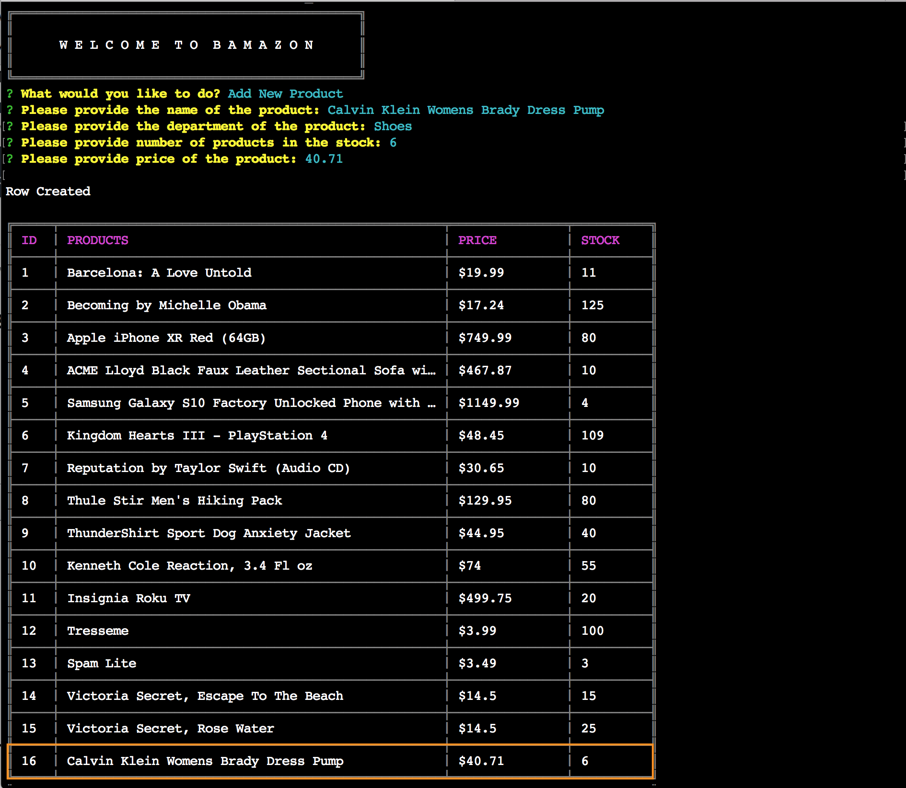

# BAMAZON - Challenge #2

### Description

In this application, Bamazon is extended to be an Inventory Manager for Store Managers.

### How It Works

1. Run the following commands to install the packages:

	- npm init -y
	- npm i inquirer
	- npm i cli-table
	- npm i mysql
	- npm i require

2. Run The SQL provided in the code

3. Once your database has been established, you can now run the application with the following command:

	node bamazon_manager.js
	

	The app has five commands available:

		a. View Products For Sale
		b. View Low Inventory
		c. Add Inventory
		d. Add New Product
		e. Exit Bamazon

### Packages Used

Inquirer - https://www.npmjs.com/package/inquirer (used for the prompts)

CLI-Table - https://www.npmjs.com/package/cli-table (used to properly display the table)

MySQL - https://www.npmjs.com/package/mysql (used for the database)

### Screenshots

1. Showing The Main Menu

2. View Products For Sale

3. View Low Inventory

4. Add Inventory

    |  
:-------------------------:|:-------------------------:

5. Add New Product

